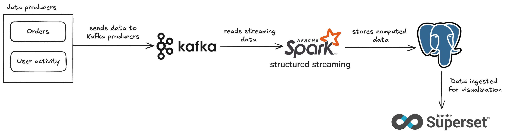

# Sales Analytics ETL Pipeline

A real-time streaming data pipeline for sales and user activity analytics built using Apache Kafka, Apache Spark Structured Streaming, PostgreSQL, and Apache Superset.

## Project Overview
This project simulates a real-time analytics platform that:
- generates sample e-commerce streaming data using Faker 
- Ingests data via Kafka producers (`orders`, `userActivity`, `productViews`)
- Processes and aggregates the data using Apache Spark
- Stores results in PostgreSQL
- Visualizes insights using Superset dashboards



## Project structure
```
sales_analytics_etl/
│
├── data_producers/          # Kafka producers generating mock data
│   ├── orders_producer.py
│   ├── product_views_producer.py
│   └── user_activity_producer.py
│
├── spark_jobs/              # Spark Structured Streaming ETL jobs
│   ├── order_aggregator.py  # aggregate revenue and order count per 5 min window
│   └── user_trend.py        # Event count per device/location/user_id per 2 min window
│
├── superset/                # Superset Docker configuration
├── .env
├── .env.template
├── data_generator.py        # Generates mock data samples
├── run_producers.py         # Runs all Kafka producers
├── postgres_table.py        # Initializes PostgreSQL table schema
└── docker-compose.yml       # Orchestrates PostgreSQL, Superset, 
```

## Technologies Used

- **Apache Kafka**: Streaming platform for ingesting data
- **Apache Spark**: Real-time data processing and aggregation
- **PostgreSQL**: Storage layer for processed summaries
- **Apache Superset**: Visualization and dashboarding
- **Docker Compose**: Service orchestration
- **Python**: Kafka producers and utility scripts

## Key Features

- Real-time order revenue aggregation (by category and payment method)
- User activity session tracking and duration calculation
- Scalable Kafka → Spark → PostgreSQL pipeline
- Superset dashboards for live monitoring

## Getting started
### Prerequisites

- Python ≥ 3.8
- Docker & Docker Compose
- Java (for Spark)
- PostgreSQL JDBC Driver (`postgresql-42.7.3.jar`)
- Apache Spark (if not running via container)

### Setup Instructions

1. Clone the repo

```bash
git clone https://github.com/your-username/sales_analytics_etl.git
cd sales_analytics_etl
```

2. Create and activate virtual env
```bash
python -m venv venv
source venv/bin/activate  # On Windows: venv\Scripts\activate
pip install -r requirements.txt
```

3. Configure database connections:

- Copy .env.template to .env
- Update the values with your database credentials

### Database setup
run the following commands to create the database tables
```bash
python postgres_table.py
```

### Running the ETL pipeline
#### Start PostgreSQL services
- follow the instructions in the [link](https://www.postgresql.org/docs/current/server-start.html)
- for macOS, install brew and install postgresql with:
```bash
brew install postgresql
```
- start the PostgreSQL services:
```bash
brew services start postgresql
```

### Start Kafka server
- install and setup Kafka ([quickstarter](https://kafka.apache.org/quickstart))
- run the commands to start the server
```bash
cd kafka_2.13-4.0.0/ 
bin/kafka-server-start.sh config/server.properties
```

### start kafka consumers
```bash
~/kafka_2.13-4.0.0/bin/kafka-console-consumer.sh --topic orders --bootstrap-server localhost:9092
~/kafka_2.13-4.0.0/bin/kafka-console-consumer.sh --topic userActivity --bootstrap-server localhost:9092
~/kafka_2.13-4.0.0/bin/kafka-console-consumer.sh --topic productViews --bootstrap-server localhost:9092
```

### run all producers at once
```bash
python run_producers.py
```

### run spark job with JDBC JAR (while in project root dir)
```bash
spark-submit \
  --packages org.apache.spark:spark-sql-kafka-0-10_2.12:3.5.5 \
  --jars ~/jars/postgresql-42.7.3.jar \
  --conf "spark.driver.extraJavaOptions=-XX:+UseG1GC" \
  --conf "spark.executor.extraJavaOptions=-XX:+UseG1GC" \
  spark_jobs/order_aggregator.py
```

```bash
spark-submit \
  --packages org.apache.spark:spark-sql-kafka-0-10_2.12:3.5.5 \
  --jars ~/jars/postgresql-42.7.3.jar \
  --conf "spark.driver.extraJavaOptions=-XX:+UseG1GC" \
  --conf "spark.executor.extraJavaOptions=-XX:+UseG1GC" \
  spark_jobs/user_trend.py
```

### set up superset and create charts and dashboards
1. clone and run the docker image
```bash
git clone https://github.com/apache/superset
cd superset
git checkout tags/4.1.2
docker compose -f docker-compose-image-tag.yml up
```

2. Log in to Superset
Visit http://localhost:8088

Username: admin
Password: admin

3. Connect database and 
In Superset:
- Settings > Data > Databases > + Database

SQLAlchemy URI - your postgresql credentials in the command:
```bash
postgresql://<user>:<password>@<host>:<port>/<database>
```

## TODO
- [ ] Dockerize Spark Jobs
- [ ] Add CI/CD using Github Actions
- [ ] Implement Apache Airflow for task orchestration